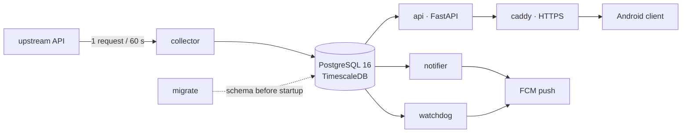

# AvelRen

[](https://github.com/ikstv/AvelRen/actions/workflows/ci.yml)


History of border-checkpoint load at Ukraine's border — for trucks.

The official source of border-checkpoint workload data shows only the current
snapshot and keeps no history. A driver sees "3 days 11 hours" and cannot tell
whether that is normal for this checkpoint or an anomaly, or when it is better to
set off.

AvelRen accumulates observations every minute and provides what the primary
source lacks: the trend, comparison between checkpoints, and a basis for
forecasting.

## The iron rule

> **Only our server talks to the upstream source. Clients — never.**

No client — web, Android, iOS, third-party script — reaches the upstream
directly. They all read our API.

This is not a stylistic preference. The upstream API returns
`x-ratelimit-limit: 60`, so a thousand clients with their own requests hit the
limit instantly, get IP-banned, and take the service down — theirs and ours. One
collector, one request every 60 seconds.

Breaking this rule is an architectural mistake, not an optimization. If a client
is missing data, we extend our API rather than let it reach out.

## How it works


```mermaid
flowchart LR
    E["upstream API"] -->|"1 request / 60 s"| C[collector]
    C --> DB[("PostgreSQL 16<br/>TimescaleDB")]
    M[migrate] -.->|"schema before startup"| DB
    DB --> API["api · FastAPI"] --> CADDY["caddy · HTTPS"] --> CL["Android client"]
    DB --> N[notifier] --> FCM["FCM push"]
    DB --> W[watchdog] --> FCM
```

- **collector** — polls the upstream source exactly once every 60 seconds,
  records observations;
- **api** — FastAPI, serves data **only from our DB**, never proxies a request;
- **notifier** — turns threshold and entry-time alerts into FCM pushes;
- **watchdog** — watches the system itself (stale data, a stale backup) and warns
  the admin devices through the same FCM path;
- **migrate** — applies the schema and exits; the services start behind it;
- **db** — PostgreSQL 16 + TimescaleDB, a time series with compression;
- **caddy** — HTTPS and reverse proxy.

`migrate`, `collector`, `notifier`, `watchdog` and `api` are one Docker image
with five different startup commands.

## Operational authorization boundary

> **WARNING: merging PR #29 does NOT AUTHORIZE any production operation.**

Specifically, merging PR #29 does not permit `production adoption`,
`production restore`, `deployment`, `credential generation`,
`credential rotation`, `legacy NOLOGIN`, `legacy REVOKE CONNECT`, or closing
issue #15. Production adoption requires a separate explicit authorization. Issue
#15 stays **OPEN even after merge**, until the production rollout and retirement
of the legacy role are separately carried out and proven safe.

## Where things are written: policy vs. state

The **authorization boundaries** — the standing limits that hold regardless of
production state — live in this repo, in [`AUTHORIZATION.md`](AUTHORIZATION.md).
They are kept public and next to the code because a boundary written where the
work does not happen is a boundary that is not enforced.

The detailed, volatile **operational state** (procedures, bring-up, CI parity,
audits, prod runbooks, and the upstream integration contract) lives in the
private ops repo `AvelRen-ops` — it names production specifics that do not
belong in a public repo.

`STATE.md` is **state only**: how far prod trails `main`, what will land in the
next Gate 11 re-prep, open PRs and issues, branch drift. It is generated by
`scripts/generate-state.sh`; **it is not hand-edited** — any edit will vanish on
the next regeneration.

The split exists because volatile facts maintained by hand went stale faster
than they were updated, and twice misled the reader who arrives without context
and has no way to verify what is written. The one volatile fact git cannot know
— the commit prod sits on — lives on a single line in `deploy/PROD_PIN` and is
updated by the operator during re-prep, in the same atomic step as the evidence
and the gate-runner copy. A pin that is not in `main`'s history is rejected by
the generator, which refuses to compute the distance rather than emit a
plausible but wrong number.

## Data source

The upstream integration contract — the endpoint, the required guest headers,
the `x-ratelimit-limit: 60` ceiling, the one-request-per-60-seconds rule, and the
response field semantics — is documented in the private ops repo `AvelRen-ops`
(`INTEGRATION.md`). It is the single place the source is named directly; the
public repo stays source-neutral. Only the `collector` service ever calls the
upstream (see the iron rule above).

Trucks only are in scope right now. The `wait_time` field is in seconds;
`vehicle_in_active_queues_counts` is the number of vehicles in the queue.

## PostgreSQL roles

The canonical model has seven separate LOGIN roles. Each application/runtime
service gets only its own `DATABASE_URL`; runtime containers do not get admin,
migrator, backup, or a neighboring service's DSN. The `db` container gets only
`POSTGRES_USER`, `POSTGRES_PASSWORD`, and `POSTGRES_DB` as bootstrap
configuration, not an application DSN.

| Role | Sole responsibility |
|---|---|
| `avelren_admin` | Only `bootstrap`, `adoption`, and `restore`; not used by applications at runtime. |
| `avelren_migrator` | Only `migration`, DDL, ownership of application objects, and `schema`/`catalog verification`. |
| `avelren_backup` | Only `pg_dump`; no writes, DDL, or restore. |
| `avelren_collector` | Runtime SQL for `countries`, `checkpoints`, `observations`, `collector_runs`, and the current threshold/ETA lifecycle; no access to devices and the health lifecycle. |
| `avelren_notifier` | Runtime SQL for `pending notification`, `delivery` state, and clearing invalid `FCM` tokens; no writing of observations or health state. |
| `avelren_watchdog` | Runtime SQL to read `observations` and `collector_runs`, write only `health_alerts`, and SELECT only `devices.id`, `devices.is_admin`, `devices.fcm_token` for health notifications; `devices.secret_hash`, all other unrelated device fields, and any device writes are forbidden. |
| `avelren_api` | Only endpoint-authorized `registration`, `authentication`, `subscription`, `ETA`, `history`, and `telemetry` SQL; no DDL and no collector writes. |

### Admin devices

`devices.is_admin` decides who the watchdog can reach with a health alert. It is
set from the host, never by hand in SQL:

```bash
python -m avelren.admin_enroll --list          # devices, and the reachable channel
python -m avelren.admin_enroll <device-id>     # promote
python -m avelren.admin_enroll <device-id> --revoke
```

It reports the number of admins that carry an FCM token, not the number flagged
`is_admin` — an admin without a token is a subscriber to nothing, and counting it
is what let the channel look armed while it was empty (issue #112). The DSN must
be allowed to write `devices`, so this is an admin/migrator operation.

The empty `AVELREN_*_PASSWORD` and `AVELREN_*_DSN` variables are listed in
`.env.example`. Real values belong only in the authorized secret store and host
configuration and never land in Git, documentation, logs, or evidence.

## Fresh install

A fresh install is an idempotent sequence, not a single transaction:

1. `create roles` via `bash deploy/postgres-bootstrap.sh fresh`.
2. `create database` with owner `avelren_admin`.
3. Provision `TimescaleDB` as admin.
4. Close the `database/schema ACL` against `PUBLIC`.
5. `migrate` as `avelren_migrator`.
6. Run the privilege and isolation `contracts`.
7. Only after GREEN checks, `start runtime`.

`postgres-bootstrap.sh fresh` requires `AVELREN_ADMIN_DSN` and all seven
`AVELREN_*_PASSWORD` in the process environment. The values are not passed as
command-line arguments. The `migrate_handoff` output means only the handover to a
separate migration gate; it does not allow skipping migrations or contracts. If a
stage fails, the runtime is not started. The `--disposable-empty-test` option is
allowed only for a provably new, empty test DB and is not a production cleanup.

The `postgres-bootstrap.sh roles-acl` mode is **disposable-only**. It rewrites
the ownership and ACL of an already-existing DB — that is, it performs the same
class of mutation as adoption — and therefore requires `AVELREN_TEST_DB=1` and a
target name containing `test` or `ci`. Applying roles and ACL to a production DB
is done exclusively through `deploy/postgres-adopt.sh`, which first proves the
preflight evidence, forward/inverse plans, and fingerprints, and has a verified
inverse rollback.

Preparing the local host configuration:

```bash
cp .env.example .env
```

All secret/DSN placeholders in the template are deliberately empty. The order of
checks and the separate slow security/DR/adoption gates are described in
[`docs/backend-testing.md`](docs/backend-testing.md).

After a separately authorized launch and passing all gates, check the API:

```bash
curl -s localhost:8000/health
```

## Android: збірка на новій машині

Потрібні JDK 17 (у CI — Temurin 17) і Android SDK: `compileSdk 35`,
`minSdk 26`. Gradle тягне себе сам через wrapper, ставити його окремо не треба.

```bash
git clone https://github.com/ikstv/AvelRen.git
cd AvelRen/android
```

Один файл доведеться покласти руками — `app/google-services.json`. Його немає
в git **навмисно**, і це не забудькуватість: репозиторій публічний, а файл
несе Firebase `api_key` і `project_id`. Перевірка в `ci.yml` валить збірку,
якщо він колись потрапить у git («У git знайдено секрети»); сам CI для збірки
підставляє заглушку. Структуру видно в
[`app/google-services.json.example`](android/app/google-services.json.example) —
значення в шаблоні навмисно порожні, як і в `.env.example`. Реальний файл
береться в Firebase-консолі проєкту: Project settings → Your apps → download
`google-services.json`.

Без цього файлу Gradle падає на плагіні `google-services` — помилка виглядає
як проблема конфігурації, хоча причина рівно одна: файлу немає.

```bash
./gradlew assembleDebug
```

`local.properties` (шлях до SDK) створює Android Studio при першому відкритті
`android/`; для збірки з терміналу достатньо `ANDROID_HOME` або `sdk.dir` у
цьому файлі. Він машинний і в git не потрапляє.

Дизайн-система, з якої написані екрани, лежить у
[`design-system/ds/`](design-system/ds/) — HTML-файли відкриваються просто в
браузері: `foundations/` (колір, тип), `components/`, `screens/`.
`checkpoints.json` там — read-only знімок реальних КПП, щоб у мокапах не
з'являлись вигадані назви й ID.

## API

| Method | Path | Description |
|---|---|---|
| `GET` | `/health` | service status and data freshness |
| `GET` | `/checkpoints` | directory of checkpoints |
| `GET` | `/workload` | latest snapshot across all queues |
| `GET` | `/history/{checkpoint_id}` | a checkpoint's history over a period |

## Documentation

| Document | What it answers |
| --- | --- |
| [AGENTS.md](AGENTS.md) | The rules an agent or developer works under — the numbered ones the CI gates enforce |
| [AUTHORIZATION.md](AUTHORIZATION.md) | What may be changed in production without asking, and what may not |
| [STATE.md](STATE.md) | Current state of the system, generated — never edited by hand |
| [docs/design.md](docs/design.md) | ROAD SIGN: the canonical design of the Android app |
| [docs/backend-testing.md](docs/backend-testing.md) | How to run the backend checks, and which one is the fast canonical gate |
| [docs/forecast.md](docs/forecast.md) | Queue forecasting — a note about a future feature, not a plan for tomorrow |
| [docs/privacy-and-retention.md](docs/privacy-and-retention.md) | What data is kept, for how long, and why |
| [docs/release-signing.md](docs/release-signing.md) | Signing an Android release for a Play Console upload |
| [docs/trusted-proxy.md](docs/trusted-proxy.md) | The `Internet → Caddy → API` boundary and what the API may trust |
| [docs/ASSETS.md](docs/ASSETS.md) | Provenance of every binary asset committed to the repo |

Operational runbooks — disaster recovery, restore rehearsals, key escrow, rollout
windows — live in a separate private repository, because they name production
endpoints and procedures. See AGENTS.md for the boundary.

## Future work

[Queue forecast for each checkpoint](docs/forecast.md) — on the accumulated
history. Not before October 2026: weekly seasonality needs 8–12 weeks of data.

## License

The data belongs to its source — the official government checkpoint-workload
system.
