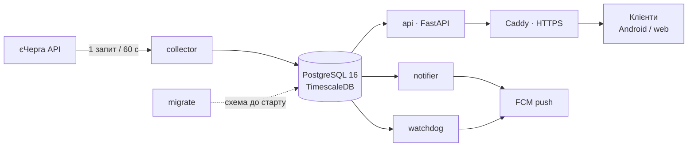

<div align="center">

# AvelRen

**Історія завантаженості пунктів пропуску на кордоні України — для вантажівок.**

*Minute-by-minute queue history for Ukraine's border checkpoints, built on the data the source doesn't keep.*

[](https://github.com/ikstv/AvelRen/actions/workflows/ci.yml)


</div>

---

Державний сервіс [єЧерга](https://echerha.gov.ua/workload/1/1) показує лише
поточний зріз черги й не зберігає історію. Водій бачить «3 дні 11 годин» і не
може зрозуміти: це норма для цього пункту чи аномалія, і коли їхати вигідніше.

AvelRen накопичує спостереження **щохвилини** й дає те, чого немає в
першоджерелі: динаміку, порівняння пунктів пропуску і ґрунт для прогнозу.

## Можливості

- 📈 **Щохвилинна історія** черг по всіх пунктах пропуску для вантажівок —
  часовий ряд у TimescaleDB зі стисненням.
- 🔔 **Push-сповіщення (FCM)**: поріг очікування та ETA-цілі, з durable
  «скасуванням» — знята тривога зникає з телефона, а не висить протухла.
- 📱 **Android-застосунок** (Kotlin + Jetpack Compose): поточний стан, історія,
  підписки, admin Server Dashboard.
- 🩺 **Самонагляд**: watchdog помічає тихі збої (мовчазний збирач, протухлий
  бекап, потребу ребута) і будить адміністратора тим самим FCM-каналом.
- 🔐 **Least-privilege PostgreSQL**: сім ізольованих runtime-ролей, кожен сервіс
  бачить лише свої таблиці й колонки.
- 💾 **Шифровані off-host бекапи** з доведеним відновленням і контрактними
  тестами всього DR-циклу в CI.

## Залізне правило

> **До `echerha.gov.ua` звертається лише наш сервер. Клієнти — ніколи.**

Жоден клієнт — веб, Android, iOS, сторонній скрипт — не ходить у єЧергу
напряму. Усі читають наш API.

Це не стильова вподоба. Державний API віддає `x-ratelimit-limit: 60`, тож
тисяча клієнтів із власними запитами миттєво впирається в ліміт, ловить бани
по IP і кладе сервіс — і чужий, і наш. Один збирач, один запит на 60 секунд.

Порушення цього правила — архітектурна помилка, а не оптимізація. Якщо клієнту
бракує даних, розширюємо наш API, а не пускаємо його назовні.

## Архітектура


```mermaid
flowchart LR
    E["єЧерга API"] -->|"1 запит / 60 с"| C[collector]
    C --> DB[("PostgreSQL 16<br/>TimescaleDB")]
    DB --> API[api · FastAPI]
    API --> CADDY[Caddy · HTTPS]
    CADDY --> CL["Клієнти<br/>Android / web"]
    DB --> N[notifier] --> FCM[FCM push]
    DB --> W[watchdog] --> FCM
    M[migrate] -.->|"схема до старту"| DB
```

| Сервіс | Роль |
|---|---|
| `collector` | опитує єЧергу рівно раз на 60 с, пише спостереження; кожен цикл фіксується, включно з невдалими |
| `api` | FastAPI; віддає дані **тільки з нашої БД**, ніколи не проксює запит назовні |
| `notifier` | доставляє threshold/ETA-сповіщення та їх скасування через FCM |
| `watchdog` | помічає, що система замовкла; найнебезпечніший збій — тихий |
| `migrate` | застосовує міграції до старту сервісів; схема не може розійтися з кодом |
| `db` | PostgreSQL 16 + TimescaleDB, стиснення після 7 днів |
| `caddy` | HTTPS (Let's Encrypt), реверс-проксі, trusted-proxy заголовки, ліміт тіла запиту |

Усі application-сервіси — один Docker-образ із різними командами запуску.
Кожен контейнер має memory/CPU-ліміти: один сервіс не може покласти хост.

## Технології

**Backend:** Python 3.12 · FastAPI · psycopg (async) · httpx
**Дані:** PostgreSQL 16 · TimescaleDB (hypertables, continuous aggregates, compression)
**Інфраструктура:** Docker Compose · Caddy · systemd timers · rclone (crypt) для бекапів
**Мобільний:** Kotlin · Jetpack Compose · Firebase Cloud Messaging
**Якість:** ruff · 300+ backend-тестів · контрактні та інтеграційні DR/adoption-гейти в CI

## Структура репозиторію

```
app/            Backend: api, collector, notifier, watchdog, migrate + тести
android/        Android-застосунок (Kotlin, Jetpack Compose)
db/migrations/  SQL-міграції (append-only, sha256-контроль застосованих)
db/security/    Bootstrap семи PostgreSQL-ролей
deploy/         Compose/Caddy, бекапи, restore- і adoption-тулінг, контракт-тести, runbooks
docs/           Операційна документація (DR, privacy, testing, forecast…)
scripts/        backend-test.sh — канонічний швидкий gate
```

## Швидкий старт (розробка)

Потрібні: Docker Desktop (з `docker compose`), Git, на Windows — Git Bash.

```bash
git clone https://github.com/ikstv/AvelRen.git
cd AvelRen
cp .env.example .env             # плейсхолдери; секретні поля лишаються порожніми
bash scripts/backend-test.sh     # канонічний швидкий backend-gate (Docker)
```

Повільні focused-гейти (privilege, backup, restore, adoption, integration) —
у [`docs/backend-testing.md`](docs/backend-testing.md). Запускайте лише те,
чого потребує задача.

## API

Базовий URL production: `https://api.bordersignal.pp.ua/api`

| Метод | Шлях | Опис |
|---|---|---|
| `GET` | `/health` | стан сервісу та свіжість даних |
| `GET` | `/checkpoints` | довідник пунктів пропуску |
| `GET` | `/workload` | останній зріз по всіх чергах |
| `GET` | `/history/{checkpoint_id}` | історія пункту за період |

Записи (реєстрація пристрою, підписки, ETA-цілі, ACK) автентифікуються парою
`X-Device-Id` + `X-Device-Secret`; перевірка — constant-time, у БД лише
SHA-256 секрета.

## Модель безпеки

Сім окремих LOGIN-ролей PostgreSQL; кожен сервіс отримує **лише свій**
`DATABASE_URL`. Runtime-контейнери не бачать admin-, migrator-, backup- чи
сусідські DSN — це закріплено контрактним тестом compose-конфігурації.

| Роль | Єдина відповідальність |
|---|---|
| `avelren_admin` | лише bootstrap, adoption і restore; не використовується в runtime |
| `avelren_migrator` | міграції, DDL, володіння application-об'єктами, schema verification |
| `avelren_backup` | лише `pg_dump`; без запису, DDL або restore |
| `avelren_collector` | запис спостережень і threshold/ETA lifecycle; без доступу до devices |
| `avelren_notifier` | доставка сповіщень і чистка невалідних FCM-токенів |
| `avelren_watchdog` | читання health-входів, запис лише `health_alerts`; колонковий доступ до devices |
| `avelren_api` | endpoint-авторизовані registration/subscription/history/telemetry запити |

Приватність: жодних акаунтів, e-mail чи телефонів; пристрій — це псевдонімний
UUID + хеш секрета; IP-адреси ніде не зберігаються. Деталі — у
[`docs/privacy-and-retention.md`](docs/privacy-and-retention.md).

## Fresh install

Fresh install — ідемпотентна послідовність, а не одна транзакція:

1. Ролі: `bash deploy/postgres-bootstrap.sh fresh` (потребує `AVELREN_ADMIN_DSN`
   і всі сім `AVELREN_*_PASSWORD` у середовищі процесу — не в аргументах).
2. База з owner `avelren_admin` + TimescaleDB.
3. Закрити database/schema ACL від `PUBLIC`.
4. Міграції від імені `avelren_migrator`.
5. Privilege- та isolation-контракти.
6. Runtime стартує лише після GREEN усіх перевірок.

Режим `roles-acl` — **disposable-only** (вимагає `AVELREN_TEST_DB=1` і цілі з
`test`/`ci` в імені): він переписує ownership/ACL наявної БД — мутація того ж
класу, що й adoption. Для production це робить виключно
`deploy/postgres-adopt.sh`, який спершу доводить preflight-evidence,
forward/inverse-плани та fingerprints і має перевірений inverse rollback —
див. [`deploy/postgres-adoption-runbook.md`](deploy/postgres-adoption-runbook.md).

## Джерело даних

```http
GET https://back.echerha.gov.ua/api/v5/workload/1
Accept: application/json
X-Client-Locale: uk
X-User-Agent: UABorder/3.9.0 Web/1.1.0 User/guest
X-Device-Id: <persistent-uuid>
X-Device-Name: AvelRen collector
```

`/1` — вантажівки, `/2` — автобуси; у скоупі лише вантажівки. Гостьовий
контракт v5: без цих заголовків сервіс віддає `403`. `X-Device-Id` —
persistent UUID гостя, не секрет. `wait_time` — у секундах;
`vehicle_in_active_queues_counts` — авто в черзі.

## Межа операційної авторизації

> **Злиття будь-якого PR не авторизує жодної production-операції.**

Production adoption, production restore, deployment, генерація чи ротація
креденшелів, `NOLOGIN`/`REVOKE CONNECT` для legacy-ролі — кожна така операція
потребує окремої явної авторизації власника. Issue
[#15](https://github.com/ikstv/AvelRen/issues/15) залишається відкритим, доки
production rollout least-privilege і retirement legacy-ролі не будуть окремо
виконані та доведені безпечними. Деталі меж — в [`AGENTS.md`](AGENTS.md) і
[`PROJECT_STATUS.md`](PROJECT_STATUS.md).

## Документація

| Документ | Про що |
|---|---|
| [`docs/backend-testing.md`](docs/backend-testing.md) | канонічний швидкий gate і повільні focused-гейти |
| [`docs/disaster-recovery.md`](docs/disaster-recovery.md) | DR runbook, включно з pre-adoption відновленням |
| [`docs/restore.md`](docs/restore.md) | процедура відновлення |
| [`docs/backup-key-escrow.md`](docs/backup-key-escrow.md) | зберігання ключів шифрування бекапів |
| [`docs/privacy-and-retention.md`](docs/privacy-and-retention.md) | інвентар даних, retention, видалення |
| [`docs/trusted-proxy.md`](docs/trusted-proxy.md) | довірений проксі та походження client IP |
| [`docs/forecast.md`](docs/forecast.md) | дизайн майбутнього прогнозу |
| [`deploy/postgres-adoption-runbook.md`](deploy/postgres-adoption-runbook.md) | least-privilege rollout на production |
| [`AGENTS.md`](AGENTS.md) | залізні правила розробки й межі авторизації |
| [`AUDIT-2026-08-14.md`](AUDIT-2026-08-14.md) | останній повний аудит проєкту |

## Дорожня карта

- **[Прогноз черг по кожному КПП](docs/forecast.md)** — на накопиченій
  історії. Не раніше жовтня 2026: тижнева сезонність потребує 8–12 тижнів
  даних.

## Ліцензія та дані

Дані належать їхньому джерелу — державній системі «єЧерга». AvelRen зберігає
лише агреговану публічну статистику завантаженості й не збирає персональних
даних користувачів джерела.
